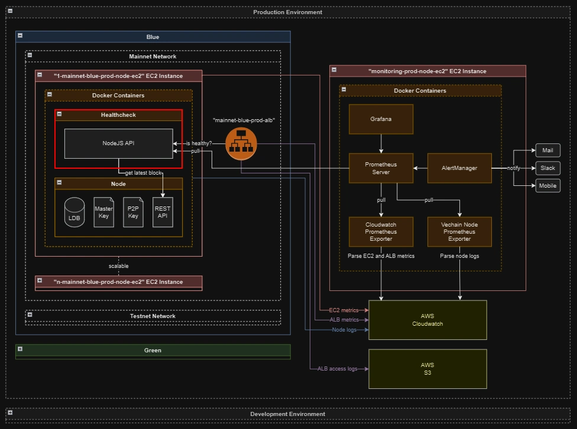

# Node Healthcheck


## Introduction

This is a simple API that checks the health of a vechain node by comparing the timestamp of its latest block with the current time. If the timestamp is within an acceptable tolerance setting, it is considered healthy.

The main purpose of this tool is to be used in load balancers and availability monitors, to determine whether a node is not only online, but also fully synchronized with the blockchain. Moreover, it provides a `metrics` endpoint that is compatible with [prometheus](https://github.com/prometheus/prometheus) and exposes node health information to it. 

The API contains two endpoints:

- `/healthcheck`

  used by ALB to determine whether the node is online

- `/metrics`

  used by Prometheus to collect health metrics, such as the last block timestamp, number of seconds since last block and node health status.



## Table of Contents

- [Node Healthcheck](#node-healthcheck)
  - [Introduction](#introduction)
  - [Table of Contents](#table-of-contents)
  - [Getting Started](#getting-started)
    - [Configuration](#configuration)
      - [NODE\_URL](#node_url)
      - [NODE\_HEALTHCHECK\_PORT](#node_healthcheck_port)
      - [NODE\_HEALTHCHECK\_TOLERANCE\_IN\_SECONDS](#node_healthcheck_tolerance_in_seconds)
    - [Using Node](#using-node)
    - [Using Docker](#using-docker)
      - [Release new docker image](#release-new-docker-image)
    - [Contributing](#contributing)
    - [Roadmap](#roadmap)
    - [Changelog](#changelog)
    - [License](#license)
    - [Credits](#credits)

## Getting Started

You can run the application with node, or in a container using docker.

### Configuration

You may override the default configuration by modifying the `.env` file.

#### NODE_URL

The URL of the node to be monitored by the healthcheck. Defaults to `https://node-test.vechain.org`

#### NODE_HEALTHCHECK_PORT

The port of the healthcheck API. Defaults to `11012`

#### NODE_HEALTHCHECK_TOLERANCE_IN_SECONDS

The amount of seconds before the healthcheck classifies the node as `unhealthy`. Defaults to `15`

### Using Node

To install and run the application with [node version 16.20.2](https://nodejs.org/dist/v16.20.2/), run the following commands in the root directory of the project:

```bash
cd src
npm ci
npm start
```

### Using Docker

To build and run the image with docker, run the following commands in the root directory of the project:

```bash
docker build . -t node-healthcheck:dev
docker run -d \
  --name node-hc \
  -p 11012:11012 \
  -e NODE_URL=https://mainnet.vechain.org \
  node-healthcheck:dev
```

To download and run the image with docker:

```bash
docker run -d \
  --name node-hc \
  -p 11012:11012 \
  -e NODE_URL=https://mainnet.vechain.org \
  public.ecr.aws/vechainfoundation/node-healthcheck:latest
```

For more image tags, refer to our [Container Registry](https://gallery.ecr.aws/vechainfoundation/node-healthcheck).

#### Release new docker image

To release a new version of the exporter, follow these steps:
1. If you haven't done so already, enable multi-architecture builds on your system:
   1. Enable Docker BuildKit for multi-architecture builds by setting the environment variable in your shell profile: `export DOCKER_BUILDKIT=1`
   2. Create Docker BuildKit builder on your system: `docker buildx create --use`
2. You will also need to have the AWS CLI installed and configured with credentials for ECR through profile `prod-node-devops`.
3. Run `./release.sh <version>` to build and push the image to ECR, where `<version>` is the tag for the new image.
4. Verify that the new release was correctly pushed to [the docker repository](https://gallery.ecr.aws/vechainfoundation/node-healthcheck).

### Contributing

If you want to contribute to this project and make it better, your help is very welcome. Contributing is also a great way to learn more about social coding on Github, new technologies and and their ecosystems and how to make constructive, helpful bug reports, feature requests and the noblest of all contributions: a good, clean pull request.

For more details and guidelines on how to contribute, refer to [CONTRIBUTING](CONTRIBUTING.md).

### Roadmap

We are planning to add more features to this application going forward. More details to follow and suggestions are always welcome in the form of [GitHub issues](https://docs.github.com/en/issues/tracking-your-work-with-issues/creating-an-issue).

### Changelog

- v1 [31-Mar-2023] Add prometheus metrics for node health
- v0 [08-Feb-2023] Implement a basic healthcheck API for nodes, based on block timestamps

### License

This project is licensed under [the MIT license](LICENSE.md).

### Credits

Special recognition to the main contributors:
- @fabiorigam
